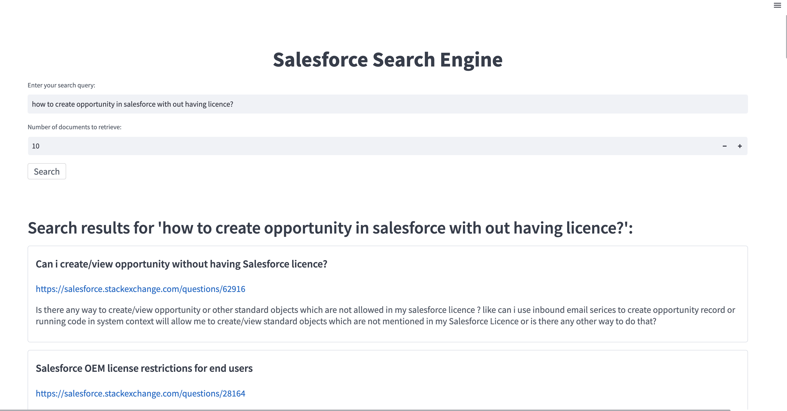

# Salesforce Search Engine

## Installation

1. `pip install git+https://github.com/deepset-ai/haystack.git`
2. `pip install streamlit`
3. `pip install uvicorn`

## Dataset

- [Stack Exchange Data Dump (Salesforce)](https://archive.org/download/stackexchange/salesforce.stackexchange.com.7z)

- Training Data: `salesforce.stackexchange.com/Posts.xml`
    - Contains 129,096 unique posts.
- Test Data: `salesforce.stackexchange.com/Test data.csv`
    - Contains 100 unique queries and their corresponding question ids.

## Model
- Model experimentation performed in `Big_Data_Project.ipynb`
- [Embedding Retriever](https://docs.haystack.deepset.ai/docs/retriever) selected for its ability to retrieve relevant documents from a large corpus of documents
    - Embedding Model: [sentence-transformers/all-MiniLM-L6-v2](https://huggingface.co/sentence-transformers/all-MiniLM-L6-v2)

## Start and Initialize ElasticSearch

To initialize ElasticDocumentStore Docker Container
- `uvicorn main:app`

This will
- Serialize NetSuite documentation as JSON documents
- Index the documents in ElasticSearch using BM25 model

## Inference

- Streamlit
    - `streamlit run app.py` is the main file for the Streamlit app
- Uvicorn
    - `uvicorn main_inference:app`

## Example Query

`how to create opportunity in salesforce with out having licence?`

## References

[1] “Beautifulsoup4,” PyPI. [Online]. Available: https://pypi.org/project/beautifulsoup4/. [Accessed: 24-Oct-2022].

[2] “Data in: documents and indices,” Elastic.co. [Online]. Available: https://www.elastic.co/guide/en/elasticsearch/reference/current/documents-indices.html. [Accessed: 24-Oct-2022].

[3] J. Devlin, M.-W. Chang, K. Lee, and K. Toutanova, “BERT: Pre-training of deep bidirectional Transformers for language understanding,” arXiv [cs.CL], 2018.

[4] L. Tunstall, L. von Werra, and T. Wolf, Natural language processing with transformers: Building language applications with hugging face. Sebastopol, CA: O’Reilly Media, 2022.

[5] “Streamlit • The fastest way to build and share data apps,” Streamlit.io. [Online]. Available: https://streamlit.io/. [Accessed: 05-Dec-2022].

[6] “Uvicorn,” Uvicorn.org. [Online]. Available: https://www.uvicorn.org/. [Accessed: 05-Dec-2022].